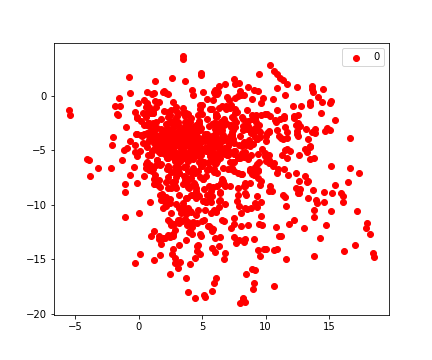

# Poodle
<ins>**P**</ins>rojecting <ins>**O**</ins>bservations <ins>**O**</ins>n a <ins>**D**</ins>eep <ins>**L**</ins>earned <ins>**E**</ins>mbedding

## Background
Clustering techniques that use deep learned embeddings often outperform conventional clustering techniques such as k-means [[1](https://www.nature.com/articles/s41598-021-91297-x)]. However, when it comes to projecting new samples onto the learned embedding there is a lack of guidelines & tools. We built POODLE to facilitate the projection of new samples onto this product space. Samples are clustered one-by-one according to their orientation in the latent space.

#### Deep learning technique
We used the autoencoder architecture of MAUI as an example. However, one could also adopt a different deep learning architecture or even a factor analysis technique (like MOFA). Currently, this github repo does not provide examples for other techniques.

#### Robust to difference in dimensionality
Poodle is flexible for situations where certain data is absent in the clinic, as one may build a shared product space and only project patients on the variables present in both sets. However, ensure that the key features are still included. The more you diverge from the initial set of features, the more you'll loose the cluster essence.

## Installation
Once you have downloaded the github repo you can install the required packages by running:

```sh
$ pip install -r requirements.txt
```

## How does poodle work?
Arguably, the best way to get familiar with the capabilities of poodle, is to start a notebook session on your device and open the following example: 
[Start here](examples/projecting_patients.ipynb) 
  
*For those that prefer to start right away, we have listed the essential functions down below:*

## Functions in poodle

#### Specify the structure of the data
You need to specify the columns for each modality, in case you want to use different modalities. If your variables are all of the same type, one list will suffice.
```python
d_input = {'cat' : list(CATEGORIC_VARIABLES), 'num' : list(NUMERIC_VARIABLES)}
```  
*Disclaimer*: Columns need to be present in both the original & new set. If there happens to be a discrepancy between the sets you need to learn a shared product space (see [this notebook](examples/projecting_patients.ipynb) for more info).
  
  
#### Prepare patient projection
```python
# Before projecting a new patient, you need to update metadata with the new information.
from poodle import utils as pup

# create metadata
df_meta = pup.getMetaDataPatient(df_cluster, list(df_cluster['pseudoId'].values), new_pat)
```

#### Project a patient onto the latent space
```python
# Now you can project the patient onto the learned embedding. You need to supply the following: 
# the model (i.e. maui), metadata, original latent space, modality information and sample data.

# project & classify a new patient
y, z = pup.predictPatientCluster(maui_model, df_meta, z_existent, d_input, sample) 

# Collect coordinates of newly added patients
z_new.append(np.array(z)[-1])
```
Output:
* `y`: the cluster probabilities for a new patient
* `z`: the coordinates of the new patient (on the latent space)
* `z_new`: the coordinates of all new patients

## Visualization in poodle
#### Check quality of replicate clusters vs shared product space
```python
from poodle import visualization as viz
import pandas as pd

# Import clustering probabilities of all new patients 
df_projection = pd.read_csv('../example_data/results/ClusterAssignment_NewPatients.csv', sep=',')

# Plot both original & replicate distribution
viz.plotQualityControl(df_cluster[['Cluster', 'pseudoId']], df_projection, z_existent, pd.DataFrame(z_new)) 
```
#### Show differences in spatial variance
```python
viz.plotSpatialVariation(l_new, l_old) 
```
#### Map a specific patient
```python
viz.plotClusterMapping(df_meta, z, new_pat)
```
#### Show top 10 closest neighbours
```python
df_neighbours = pup.find_neighbours(df_meta, z, new_pat)
viz.plot_neighbours(df_neighbours, new_pat)
```

#### Identify batch effects with tSNE
```python
pup.plot_tsne(fit1, group_id=metadata_original['IS_REPLICATE'], path='figures/original/tsne_original.png')
pup.plot_tsne(fit2, group_id=metadata_w_replicates['IS_REPLICATE'], path='figures/replication/tsne_replication_projected.png')
```
Product space (2D representation)            |  Newly projected patients on product space
:-------------------------:|:-------------------------:
  |  


## WIP
Be aware that this github repo is still a work in progress. We will update the readme as we make new additions to the tool. For example: we aim to add baseline comparison and batch correction in the near future. Furthermore, we want to improve the functionality for users that work with uniform data (w/ single modality). 
